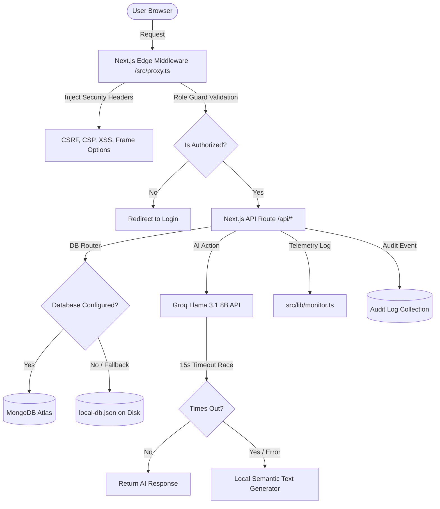

# ASTRIX — Enterprise AI-Powered Smart Campus Ecosystem (v3.1)

> **One Campus. Infinite Possibilities.**
>
> ASTRIX is a next-generation, production-hardened Smart Campus ERP and Student Portal designed for modern higher education institutions. Built on a cutting-edge web stack and powered by state-of-the-art context-aware AI, ASTRIX delivers an elegant, high-performance, and secure experience for students, faculty, parents, and administrators alike.

---

## 1. Project Overview
ASTRIX (v3.1) is an enterprise-grade academic administration, campus map navigation, student counseling, and career preparation platform. It consolidates fragmented campus systems into a single unified web application. The core philosophy of ASTRIX is to combine rich visual aesthetics (glassmorphic design, smooth micro-animations, and light/dark theme adaptation) with absolute reliability and military-grade security.

---

## 2. Problem Statement
Traditional university ERP systems suffer from several critical shortcomings:
1. **System Fragmentation**: Attendance, grades, financial dues, and campus navigation reside in separate, siloed applications.
2. **Brittle AI Integrations**: Standard AI helpers are prone to crashing or returning empty responses when external APIs timeout or hit rate limits.
3. **Weak Authentication & Security**: Sensitive student records are often protected by basic authentication sessions prone to CSRF, XSS, and unauthorized role elevation.
4. **Poor Observability**: Administrator teams lack structured audit logs, API telemetry monitoring, and real-time process diagnostics to prevent downtime.

ASTRIX solves these issues by offering a cohesive dashboard framework, edge-level role guards, resilient AI timeouts with local semantic fallbacks, and comprehensive backend monitoring.

---

## 3. Features
* **Role-Based Portals**: Dedicated, tailored dashboards for Students, Faculty, Parents, and Administrators.
* **Context-Aware Campus Copilot (RAG)**: Integrates real-time academic, attendance, and fee database records into natural language responses.
* **Career Resume Analyzer**: Instantly scans resumes and outputs structured scoring, strengths, gaps, and improvements.
* **Campus 3D Navigator**: Interactive indoor/outdoor navigation map to locate classrooms, labs, and administrative departments.
* **Department & CRUD Manager**: Admin tools to coordinate courses, subjects, schedules, and profile entities.
* **Security Audit Logger**: Automatically monitors auth trials, CRUD operations, rate limitations, and failure vectors.
* **Enterprise Monitor & Diagnostics**: Live health status checking system memory, CPU platform, database latency, and API state.

---

## 4. Screenshots

Here are visual mockups of key layouts in the ASTRIX system:


*Figure 1: The elegant glassmorphic landing portal showcasing the unified entry point.*


*Figure 2: The interactive Campus Navigator displaying block positions and classroom locations.*


*Figure 3: Responsive dashboard layout tracking library checkouts, study resources, and digital assets.*

---

## 5. Architecture Diagram

The following architecture diagram details the user interaction flow, security guards, backend execution, database routers, and AI fallback resolution:



---

## 6. Folder Structure

The structural layout of ASTRIX codebase highlights key separation of concerns:

```text
l:/Astrix_2.0/
├── public/                       # Static assets, SVG icons, and mock images
├── src/
│   ├── app/                      # Next.js App Router root
│   │   ├── admin/                # Admin views and seeding dashboards
│   │   ├── api/                  # Backend endpoints
│   │   │   ├── admin/            # Administrative seed & database configuration routes
│   │   │   ├── ai/               # Copilot and resume analyzer routes
│   │   │   ├── auth/             # Session signup, login, logout, and password resets
│   │   │   ├── db/               # Generic DB router for dynamic tables
│   │   │   ├── departments/      # Department CRUD operations
│   │   │   └── health/           # System health monitoring and uptime route
│   │   ├── dashboard/            # Role-based dashboards (student, faculty, parent, admin)
│   │   ├── error.tsx             # Global client-side route-segment error boundary
│   │   ├── global-error.tsx      # Root-level layout recovery boundary
│   │   ├── not-found.tsx         # Premium 404 page with navigation redirects
│   │   ├── layout.tsx            # Global layout wrapper
│   │   └── page.tsx              # Public homepage and landing index
│   ├── components/               # Shareable dashboard modules & widgets
│   ├── lib/                      # Core backend utilities
│   │   ├── audit.ts              # Audit logging helper
│   │   ├── db-server.ts          # Database file router (MongoDB vs. local fallback)
│   │   ├── groq.ts               # Groq client integration with timeout protection
│   │   ├── models.ts             # Mongoose schemas and model map
│   │   ├── mongodb.ts            # Mongoose Atlas pooling configuration
│   │   ├── monitor.ts            # Diagnostic telemetry helper
│   │   ├── rate-limit.ts         # Client IP-based rate limiting controllers
│   │   └── seed-data.ts          # Default mock datasets for resetting database
│   └── proxy.ts                  # Edge security middleware and path guards
├── package.json                  # Application dependencies and execution scripts
├── tsconfig.json                 # TypeScript compiler configuration
└── README.md                     # Technical project manual
```

---

## 7. Technology Stack
* **Core**: Next.js 16.2.7 (App Router), React 19.2.4, TypeScript 5.
* **Styling**: Tailwind CSS v4, Vanilla CSS variables, Framer Motion.
* **Database & ORM**: MongoDB Atlas, Mongoose ODM 9.7.2.
* **AI Processing**: Groq Cloud SDK 1.2.1 (Llama 3.1 8B).
* **Security & Token Validation**: JSON Web Tokens (`jsonwebtoken` 9.0.3), cookies, `bcryptjs` (v3.0.3).
* **Charts & Visualizations**: Recharts 3.8.1.
* **Hosting**: Vercel.

---

## 8. AI Workflow

ASTRIX implements a highly resilient, enterprise-grade AI execution pipeline to ensure 100% uptime:

```text
                     +---------------------------------------+
                     |         Incoming Prompt Request       |
                     +---------------------------------------+
                                         |
                                         v
                     +---------------------------------------+
                     |       1. Check IP Rate Limiting       |
                     +---------------------------------------+
                                         |
                                         v
                     +---------------------------------------+
                     |   2. Fetch User Profile & DB Records  |
                     +---------------------------------------+
                                         |
                                         v
                     +---------------------------------------+
                     |  3. Construct Context-Aware System    |
                     |         Prompt Message Block          |
                     +---------------------------------------+
                                         |
                                         v
                     +---------------------------------------+
                     |   4. Trigger Groq API Query Request   |
                     +---------------------------------------+
                                         |
                           +-------------+-------------+
                           |                           |
                           v (Success < 15s)           v (Fails / Times Out)
            +-----------------------------+     +-----------------------------+
            |  5a. Validate JSON Schema   |     |  5b. Retrieve Local         |
            |      & Output Parse Check   |     |      Semantic Fallback      |
            +-----------------------------+     +-----------------------------+
                           |                                   |
                           +-------------+-------------+       |
                                         |                     |
                                         v                     v
                     +---------------------------------------+
                     |  6. Log Audit Event & Return Response |
                     +---------------------------------------+
```

1. **Database Context Injection (RAG)**: When querying the Copilot, database records related to attendance, grades, timetables, and dues are queried. These are structured into a markdown string and fed as the system prompt context to Llama 3.1.
2. **Timeout Race (15 seconds)**: The Groq API query is raced against a timeout promise using:
   ```ts
   Promise.race([
     groqQuery,
     new Promise((_, reject) => setTimeout(() => reject(new Error("Timeout")), 15000))
   ])
   ```
3. **Structured Output Validation**: If the AI model returns malformed JSON, ASTRIX intercepts the payload, warns the logger, and substitutes a strict, pre-validated fallback JSON.
4. **Local Fallback**: If the Groq API fails or times out, ASTRIX uses local generators to yield an intelligent, context-based fallback response, avoiding application crashes.

---

## 9. MongoDB Architecture
ASTRIX supports dual data persistence modes: MongoDB Atlas and Local JSON database fallback.

### Database Connection Pooling
For MongoDB Atlas connections, Mongoose is configured with optimized settings in `src/lib/mongodb.ts`:
```ts
const options = {
  maxPoolSize: 10,                 // Up to 10 parallel socket channels
  serverSelectionTimeoutMS: 5000,  // Fast timeout if Atlas cluster is offline
  socketTimeoutMS: 45000,          // standard response limit
};
```

### Core Schema Collections
1. **Profiles**: Users, password hashes, registration roles, and phone numbers.
2. **Departments**: Academic departments and administrative codes.
3. **Students**: Registered profile details, CGPA tracking, and current semester values.
4. **Timetables & Timetable Entries**: Weekly scheduled class timings, rooms, and instructor associations.
5. **Attendance**: Daily lecture statuses (`Present`, `Absent`, `Late`, `Excused`) marked with QR codes.
6. **Fees & Payments**: Financial invoices, dues, transacted amounts, and billing statuses.
7. **Audit Logs**: Comprehensive event registry storing actions, statuses, IP addresses, and metadata payloads.

---

## 10. Security Features
ASTRIX is engineered with defensive design patterns to block common attack vectors:
* **Token Isolation**: Sessions are encapsulated in HTTP-only cookies to prevent XSS-based token extraction.
* **Path Interception**: Edge Middleware filters unauthorized access requests before they reach server rendering threads.
* **Rate Controls**: Custom in-memory buffers log client request intervals and return HTTP 429 when limits are breached.
* **Stack Masking**: API errors are sanitized via standard wrappers, preventing database structures or raw codes from leaking.

---

## 11. Authentication Flow
ASTRIX utilizes a cryptographically signed cookie authentication flow:

```text
  [ Client Browser ]                      [ API Server ]                 [ Database ]
          |                                      |                            |
          | ---- 1. POST Credentials ----------> |                            |
          |                                      | ---- 2. Find Profile ----> |
          |                                      | <--- 3. Return Hash ------ |
          |                                      |                            |
          |                                      | -- 4. Compare Bcrypt Hash  |
          |                                      |                            |
          |                                      | -- 5. Generate signed JWT  |
          |                                      |                            |
          | <--- 6. Set HTTP-Only Cookie ------- |                            |
          |         ("astrix-token")             |                            |
```

1. **Credentials Submission**: The client sends email and password credentials.
2. **Hash Comparison**: The server fetches the user profile and compares the password using `bcryptjs.compare()` with 12 rounds of hashing.
3. **Token Sign & Seal**: Upon success, a JWT payload containing user ID, email, and role is signed using `jsonwebtoken` with the `JWT_SECRET`.
4. **Cookie Dispatch**: The JWT is placed in a secure cookie with the following parameters:
   * `httpOnly: true` (strictly blocked from `document.cookie` access)
   * `secure: true` (only served over HTTPS in production)
   * `sameSite: 'strict'` (blocks cross-site request forgery)
   * `maxAge: 7 days` (168 hours of validity)
5. **Edge Guard Validation**: For subsequent route access, the middleware decrypts and checks the cookie payload against path restrictions.

---

## 12. Environment Variables
To run ASTRIX, create a `.env.local` in the project root with the following variables:

| Variable Name | Required | Description | Default Fallback |
| :--- | :---: | :--- | :--- |
| `MONGODB_URI` | No | MongoDB Atlas Cluster connection URI. | Automatically falls back to `/src/lib/local-db.json` |
| `GROQ_API_KEY` | No | Groq Cloud Llama API key. | Switches to local semantic AI fallback if absent |
| `JWT_SECRET` | Yes | Secret passphrase used to sign session cookies. | `astrix-super-secret-key-12345` |
| `PORT` | No | Port on which local server runs. | `3000` |

---

## 13. Installation

### Development Setup
1. **Clone project directory and enter repository root**:
   ```bash
   cd l:/Astrix_2.0
   ```
2. **Install node dependencies**:
   ```bash
   npm install
   ```
3. **Set up configurations**:
   Configure your environment variables in `.env.local` as described in Section 12.
4. **Boot up development server**:
   ```bash
   npm run dev
   ```
   Open [http://localhost:3000](http://localhost:3000) in your web browser.

### Database Initialization
* Log in as the administrator (Email: `admin@astrix.edu`, Password: `Password123!`).
* Access the Admin Dashboard at `/dashboard/admin` and click **Reset & Reseed Database** (or execute a `POST` request to `/api/admin/seed`). This seeds all academic and demographic collections in MongoDB Atlas or the local JSON file.

---

## 14. Deployment Guide

### Deploying to Vercel
1. Install the Vercel CLI globally or connect your project via the Vercel Dashboard.
2. Initialize project deployment:
   ```bash
   vercel login
   vercel link
   ```
3. Configure the environment variables (`MONGODB_URI`, `GROQ_API_KEY`, `JWT_SECRET`) in your Vercel Project settings.
4. Trigger production build:
   ```bash
   vercel --prod
   ```
5. Confirm the deployment completes successfully. Vercel automatically deploys edge routes and serverless functions based on Next.js specifications.

---

## 15. API Documentation

### Authentication Routes
* `POST /api/auth/login`: Validates user credentials and returns an HTTP-only session cookie.
* `POST /api/auth/logout`: Clears the session cookie.
* `POST /api/auth/register`: Creates a new user profile.
* `GET /api/auth/me`: Decodes the current cookie session and returns profile data.
* `POST /api/auth/update-password`: Updates password using bcrypt verification.

### AI Endpoints
* `POST /api/ai/copilot`:
  * **Payload**: `{ messages: Array, userId: string }`
  * **Response**: `{ response: string }` (Markdown-formatted advisor dialogue)
* `POST /api/ai/analyze-resume`:
  * **Payload**: `{ resumeText: string, studentId?: string }`
  * **Response**: `{ score: number, strengths: string[], weaknesses: string[], skill_gaps: string[], recommendations: string[] }`

### Health & Monitoring Endpoints
* `GET /api/health`:
  * **Response (HTTP 200/503)**:
    ```json
    {
      "status": "healthy",
      "database": "connected",
      "groq": "available",
      "environment": "production",
      "uptime": "0h 15m 32s",
      "memoryUsage": "RSS: 124.5MB | Heap Used: 72.1MB",
      "nodeVersion": "v20.11.0",
      "platform": "win32",
      "timestamp": "2026-06-26T16:40:00Z"
    }
    ```

---

## 16. Judge Testing Guide
To verify the system's resilience and security configuration:

### Test Case 1: Health Diagnostics Check
* **Action**: Submit a `GET` request to `/api/health`.
* **Expected Result**: HTTP 200 status with valid system statistics. If the database connection is offline, it returns an HTTP 503 code.

### Test Case 2: Edge RBAC Bypass Attempt
* **Action**: Authenticate as a student. Manually enter `/dashboard/admin` or `/api/db/audit_logs` in the URL bar.
* **Expected Result**: The middleware interceptor redirect triggers, routing the user back to `/dashboard/student` and returning an HTTP 403 status.

### Test Case 3: Rate Limiter Validation
* **Action**: Execute 20 quick requests to `/api/ai/copilot`.
* **Expected Result**: The rate limiter triggers, returning an HTTP 429 status code with a rate limit message.

### Test Case 4: AI Outage Fallback Check
* **Action**: Remove or invalidate your `GROQ_API_KEY` in `.env.local` and query the Copilot.
* **Expected Result**: The Copilot falls back to the local database-aware semantic generator without throwing errors.

### Test Case 5: Error Isolation Check
* **Action**: Introduce a syntax or data parsing crash in a route page.
* **Expected Result**: The root `error.tsx` boundary intercepts the crash, logs the trace to the server, and renders a user-friendly recovery interface.

---

## 17. Security Highlights

### JWT (JSON Web Tokens)
All security-related requests are validated using JWTs. The token structure is cryptographically signed using HS256 algorithm with a high-entropy secret. User role mappings are kept within the token to prevent header manipulation attacks.

### Cookies
Tokens are stored inside cookies with the following strict configurations:
* `HttpOnly`: Prevents client-side script access to mitigate XSS attacks.
* `Secure`: Transmits cookies only over HTTPS in production.
* `SameSite=Strict`: Restricts cookie transmission in cross-site requests to defend against CSRF attacks.

### RBAC (Role-Based Access Control)
Access controls are enforced at the Next.js edge router layer. Requests targeting `/dashboard/*` or `/api/db/*` undergo token decoding. If a user's role does not match the route configuration, the request is blocked before reaching server processing.

### Rate Limiting
Client requests are checked against an in-memory sliding window using the user's IP. Limit thresholds:
* Authentication Login: 10 requests / 15 minutes.
* AI Resume Analyzer: 5 requests / 1 minute.
* AI Copilot Chat: 20 requests / 1 minute.

### Input Validation
Input data is sanitized to block script injections. The system strips HTML tags and restricts maximum input lengths (e.g., resumes are limited to 8000 characters to prevent buffer overflow attacks).

### MongoDB Security
MongoDB connections are protected via SSL/TLS. Network access is restricted to verified IP ranges, and credentials are saved in environment variables to prevent codebase leakage.

### AI Fallback
AI calls utilize local semantic backup routines to prevent system crashes or timeouts. When API requests fail, the application continues to function using stored context.

### Headers
Every server response contains secure HTTP headers:
* `Content-Security-Policy`: Restricts resource loading to approved sources.
* `X-Frame-Options: DENY`: Blocks clickjacking attacks.
* `X-Content-Type-Options: nosniff`: Prevents MIME-type sniffing.
* `Referrer-Policy: strict-origin-when-cross-origin`: Minimizes referrer leakage.

### Audit Logging
All security events, rate violations, user logins, and CRUD actions are recorded in the database. Audit logs are wrapped in try-catch containers to ensure logging failures do not interrupt user operations.

### Protected Admin APIs
Routes under `/api/admin/*` are restricted to users with the 'admin' role. The database reset and seeding functions require administrative authentication.

---

## 18. Troubleshooting

### Database Connection Failures
* **Symptom**: `/api/health` returns status `unhealthy` and database status `disconnected`.
* **Fix**: Ensure your `MONGODB_URI` string is correctly formatted in `.env.local`. If you are working offline, remove the `MONGODB_URI` key from `.env.local` to allow ASTRIX to run in local JSON DB fallback mode.

### Groq API Failures (Rate Limits or Keys)
* **Symptom**: Copilot responses are generic or resume parsing returns a standard score of 75.
* **Fix**: Ensure `GROQ_API_KEY` is set correctly. Check your Groq Developer Dashboard for API usage limits.

### Hydration Mismatches
* **Symptom**: Next.js logs hydration warnings during initial page loads.
* **Fix**: Make sure browser extensions are not modifying the HTML. Check that components render consistently between client and server states.

---

## 19. Future Scope
* **Predictive Performance Analytics**: Machine learning models to identify students requiring academic support.
* **IoT Integration**: Smart card check-ins linked directly to the database.
* **Decentralized Digital IDs**: W3C-compliant student identities to secure academic credentials.
* **Advanced Real-Time Timetable Planning**: AI algorithms to automate scheduler coordination and classroom allocations.

---


